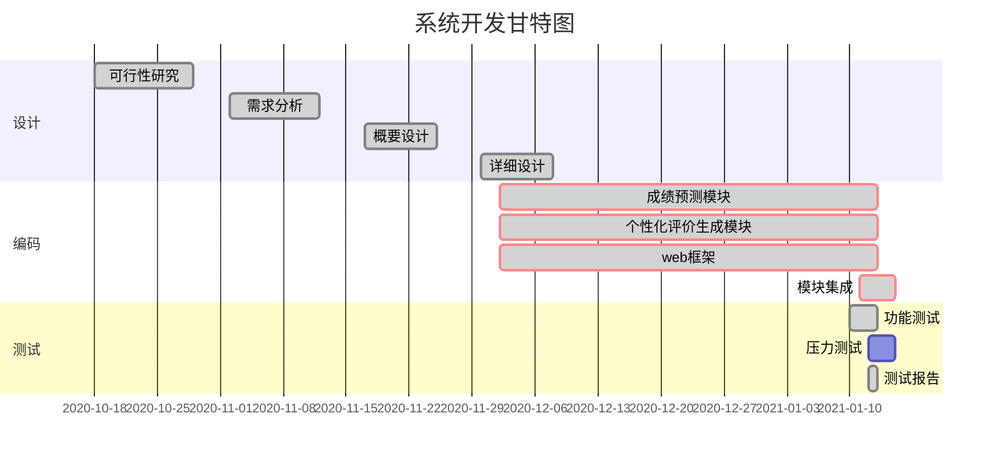

# Personalized-Evaluation-System
## 针对学生的个性化评价系统

### 系统描述：
（1）目的：根据学生的上课情况和学习状态，做出成绩预测以及针对每名学生个性化的评价。  
（2）主要功能：通过学习平台或者网络爬虫获取学生上课状态和课堂讨论数据，运用深度学习自然语言
处理技术，预测学生的成绩。构建心理学模型，对学生做出分类预测并做出个性化评价，实现因材施教。

### 数据来源：
- [北京大学moodle学习平台](http://120.77.86.170/moodle/)
- 社交平台

### 成果展示：
 - [网站](https://tesseract-r.github.io/Personalized-Evaluation-System/)

### 可行性研究报告：[链接](可研报告/可研报告.pdf)
### 需求规约说明书：[链接](https://github.com/Tesseract-R/Personalized-Evaluation-System/blob/main/%E9%9C%80%E6%B1%82%E5%88%86%E6%9E%90/%E9%9C%80%E6%B1%82%E8%A7%84%E6%A0%BC%E8%AF%B4%E6%98%8E%E4%B9%A6%20%2B%20%E7%AC%AC%E5%85%AB%E7%BB%84%20%2B%20%E9%92%88%E5%AF%B9%E5%AD%A6%E7%94%9F%E7%9A%84%E4%B8%AA%E6%80%A7%E5%8C%96%E8%AF%84%E4%BB%B7%E7%B3%BB%E7%BB%9F.pdf)
### 概要设计说明书：[链接](https://github.com/Tesseract-R/Personalized-Evaluation-System/blob/main/%E6%A6%82%E8%A6%81%E8%AE%BE%E8%AE%A1/%E6%A6%82%E8%A6%81%E8%AE%BE%E8%AE%A1%E8%AF%B4%E6%98%8E%E4%B9%A6%20%2B%20%E7%AC%AC%E5%85%AB%E7%BB%84%20%2B%20%E9%92%88%E5%AF%B9%E5%AD%A6%E7%94%9F%E7%9A%84%E4%B8%AA%E6%80%A7%E5%8C%96%E8%AF%84%E4%BB%B7%E7%B3%BB%E7%BB%9F.pdf)

### 详细设计说明书：[链接](https://github.com/Tesseract-R/Personalized-Evaluation-System/blob/main/%E8%AF%A6%E7%BB%86%E8%AE%BE%E8%AE%A1/%E8%AF%A6%E7%BB%86%E8%AE%BE%E8%AE%A1%E8%AF%B4%E6%98%8E%E4%B9%A6%20%2B%20%E7%AC%AC%E5%85%AB%E7%BB%84%20%2B%20%E9%92%88%E5%AF%B9%E5%AD%A6%E7%94%9F%E7%9A%84%E4%B8%AA%E6%80%A7%E5%8C%96%E8%AF%84%E4%BB%B7%E7%B3%BB%E7%BB%9F.pdf)

### 第一次线下会议记录（11/13）：[链接](https://github.com/Tesseract-R/Personalized-Evaluation-System/blob/main/%E4%BC%9A%E8%AE%AE%E8%AE%B0%E5%BD%95/11%E6%9C%8813%E6%97%A5%E4%BC%9A%E8%AE%AE%E8%AE%B0%E5%BD%95.md)

### 第二次线下会议记录（11/18）：[链接](https://github.com/Tesseract-R/Personalized-Evaluation-System/blob/main/%E4%BC%9A%E8%AE%AE%E8%AE%B0%E5%BD%95/11%E6%9C%8818%E6%97%A5%E4%BC%9A%E8%AE%AE%E8%AE%B0%E5%BD%95.md)

### 第三次线下会议记录（12/2）：[链接](https://github.com/Tesseract-R/Personalized-Evaluation-System/blob/main/%E4%BC%9A%E8%AE%AE%E8%AE%B0%E5%BD%95/12%E6%9C%882%E6%97%A5%E4%BC%9A%E8%AE%AE%E8%AE%B0%E5%BD%95.png)

